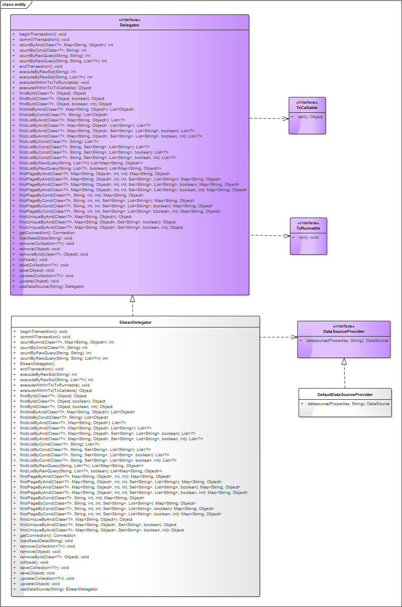

**OFBiz Smart**的实体引擎基于[Ebean6.x](https://github.com/ebean-orm/avaje-ebeanorm) 构建.

通过**Delegator**接口对上层服务提供常见的数据访问操作，支持多个数据源，支持接入外部可配置的数据源**DataSource**

### 核心类图

>Delegator 定义了各种与实体操作的相关API，并依赖 TxRunnable 和 TxCallable 接口，以支持事务操作。

>EbeanDelegator 基于Ebean6.x 实现了 Delegator，并依赖 DataSourceProvider，以支持多数据源。

>DataSourceProvider 数据源提供者接口，定义了具体的数据源实现必须要实现的方法。

>DefaultDataSourceProvider 框架内置的默认数据源提供者实现。