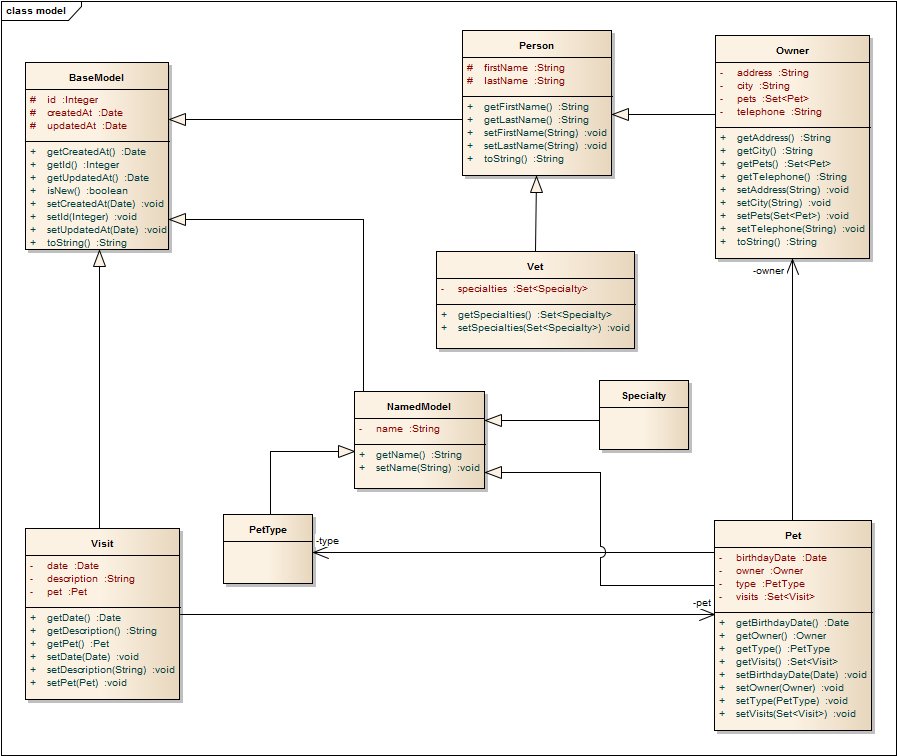

# 实体模型



## BaseModel.java

```
@MappedSuperclass
public class BaseModel {
  @Id
  @GeneratedValue(strategy = GenerationType.IDENTITY)
  protected Integer id;

  @WhenCreated
  protected Date createdAt;

  @WhenModified
  protected Date updatedAt;

  public Integer getId() {
    return id;
  }

  public void setId(Integer id) {
    this.id = id;
  }

  public boolean isNew() {
    return (this.id == null);
  }

  public Date getCreatedAt() {
    return createdAt;
  }

  public void setCreatedAt(Date createdAt) {
    this.createdAt = createdAt;
  }

  public Date getUpdatedAt() {
    return updatedAt;
  }

  public void setUpdatedAt(Date updatedAt) {
    this.updatedAt = updatedAt;
  }

  @Override
  public String toString() {
    StringBuilder builder = new StringBuilder();
    builder.append("BaseModel [id=");
    builder.append(id);
    builder.append(", createdAt=");
    builder.append(createdAt);
    builder.append(", updatedAt=");
    builder.append(updatedAt);
    builder.append("]");
    return builder.toString();
  }
}
```

## NamedModel.java

```
@MappedSuperclass
public class NamedModel extends BaseModel {
  @Required
  private String name;

  public String getName() {
    return name;
  }

  public void setName(String name) {
    this.name = name;
  }
}
```

## Owner.java

```
@Entity
@Table(name = "owners")
public class Owner extends Person {
  @Required
  private String address;

  private String city;

  private String telephone;
  
  @OneToMany
  @OrderBy("createdAt desc")
  private Set<Pet> pets;

  public String getAddress() {
    return address;
  }

  public void setAddress(String address) {
    this.address = address;
  }

  public String getCity() {
    return city;
  }

  public void setCity(String city) {
    this.city = city;
  }

  public String getTelephone() {
    return telephone;
  }

  public void setTelephone(String telephone) {
    this.telephone = telephone;
  }

  public Set<Pet> getPets() {
    return pets;
  }

  public void setPets(Set<Pet> pets) {
    this.pets = pets;
  }

  @Override
  public String toString() {
    StringBuilder builder = new StringBuilder();
    builder.append("Owner [address=");
    builder.append(address);
    builder.append(", city=");
    builder.append(city);
    builder.append(", telephone=");
    builder.append(telephone);
    builder.append(", pets=");
    builder.append(pets);
    builder.append("]");
    return builder.toString();
  }  
}
```

## Person.java

```
@MappedSuperclass
public class Person extends BaseModel {

  @Required
  protected String firstName;


  protected String lastName;

  public String getFirstName() {
    return this.firstName;
  }

  public void setFirstName(String firstName) {
    this.firstName = firstName;
  }

  public String getLastName() {
    return this.lastName;
  }

  public void setLastName(String lastName) {
    this.lastName = lastName;
  }

  @Override
  public String toString() {
    StringBuilder builder = new StringBuilder();
    builder.append("Person [firstName=");
    builder.append(firstName);
    builder.append(", lastName=");
    builder.append(lastName);
    builder.append("]");
    return builder.toString();
  }
}
```

## Pet.java

```
@Entity
@Table(name = "pets")
public class Pet extends NamedModel {

  private Date birthdayDate;

  @ManyToOne
  private PetType type;

  @ManyToOne
  private Owner owner;


  @OneToMany(cascade = CascadeType.ALL, mappedBy = "pet", fetch = FetchType.EAGER)
  @OrderBy("createdAt desc")
  private Set<Visit> visits;


  public Date getBirthdayDate() {
    return birthdayDate;
  }


  public void setBirthdayDate(Date birthdayDate) {
    this.birthdayDate = birthdayDate;
  }


  public PetType getType() {
    return type;
  }


  public void setType(PetType type) {
    this.type = type;
  }


  public Owner getOwner() {
    return owner;
  }


  public void setOwner(Owner owner) {
    this.owner = owner;
  }


  public Set<Visit> getVisits() {
    return visits;
  }


  public void setVisits(Set<Visit> visits) {
    this.visits = visits;
  }


}
```

## PetType.java

```
@Entity
@Table(name = "pet_types")
public class PetType extends NamedModel {
  
}
```

## Specialty.java

```
@Entity
@Table(name = "specialties")
public class Specialty extends NamedModel {

}
```

## Vet.java

```
@Entity
@Table(name = "vets")
public class Vet extends Person {
  @ManyToMany(fetch = FetchType.EAGER)
  @JoinTable(name = "vet_specialties", joinColumns = @JoinColumn(name = "vet_id") , inverseJoinColumns = @JoinColumn(name = "specialty_id") )
  private Set<Specialty> specialties;

  public Set<Specialty> getSpecialties() {
    return specialties;
  }

  public void setSpecialties(Set<Specialty> specialties) {
    this.specialties = specialties;
  }
}
```

## Visit.java

```
@Entity
@Table(name = "visits")
public class Visit extends BaseModel {
  @ManyToOne
  private Pet pet;
  
  private Date date;

  private String description;

  

  public Date getDate() {
    return date;
  }

  public void setDate(Date date) {
    this.date = date;
  }

  public String getDescription() {
    return description;
  }

  public void setDescription(String description) {
    this.description = description;
  }

  public Pet getPet() {
    return pet;
  }

  public void setPet(Pet pet) {
    this.pet = pet;
  }


}

```