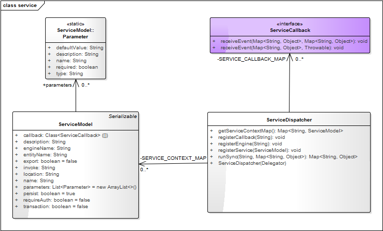
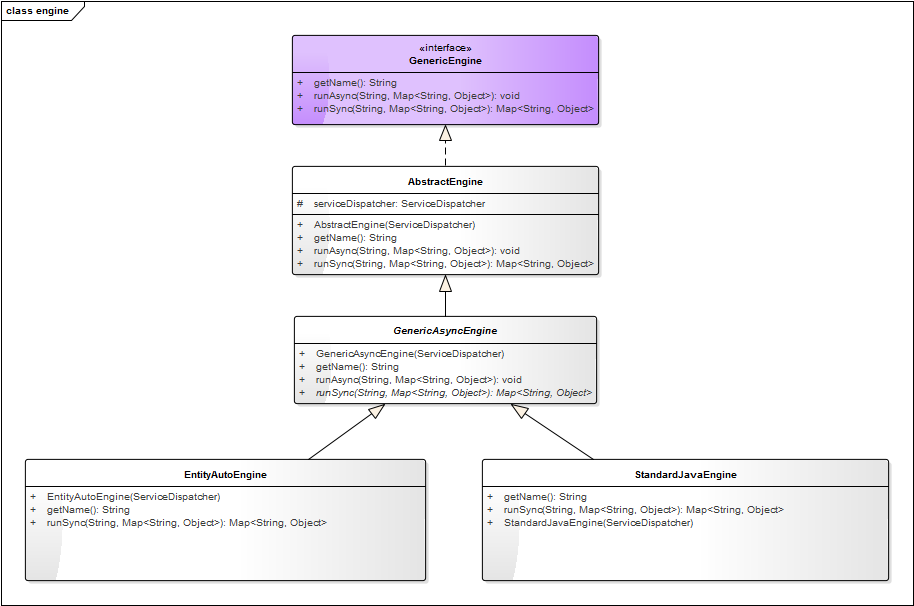

**服务引擎**指的是服务的定义，服务的执行，服务的调度，服务的验证等与服务相关的功能集总称。

**服务引擎**主要负责将定义好的服务，以同步或是异步的方式执行，或是以通过**Job**的形式来安排执行哪个服务。

在服务执行之前，对服务进行输入参数的验证，或是对需要授权的服务，进行认证操作。服务执行成功后，执行定义的服务回调。

### 核心类图

>ServiceDispatcher 服务的执行入口，负责查找服务，并指定具体的服务引擎来执行，同时提供服务引擎的注册，服务的注册，服务回调的注册等。

>ServiceCallback 服务回调接口，它定义了服务成功执行后的回调方法 和 服务发生异常时的回调方法。

>ServiceModel 服务定义模型，它持有服务定义的元数据，包括服务的定义，服务的输入输出参数定义 Parameter

>GenericEngine 服务引擎根接口，它定义了服务引擎必须要实现的三个方法，即获取引擎的名称，同步执行服务，异步执行服务。

>AbstractEngine 服务引擎抽象类，它只定义了服务引擎的初始构造方法，该初始化构造方法必须依赖服务对象 ServiceDispatcher。

>GenericAsyncEngine 普通的异步执行服务抽象类，它仅实现了异步执行方法。

>StandardJavaEngine 标准服务引擎实现类，它负责标准定义的Java服务的执行。

>EntityAutoEngine 实体自动处理引擎实现类，它在实体基础之上，自动处理实体的CRUD操作。